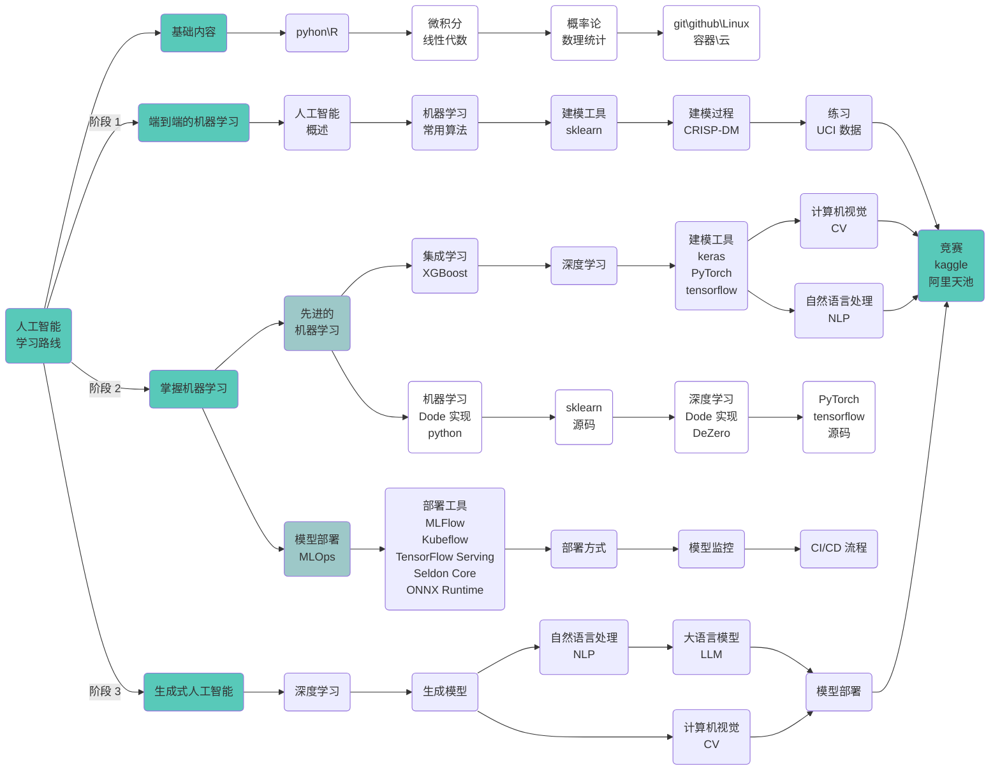

## 学习路径图

```mermaid
flowchart LR
    A(人工智能<br>学习路线):::someclassA --> B(基础内容):::someclassA 
        classDef someclassA fill:#58C9B9
        classDef someclassB fill:#9DC8C8
        classDef someclassC fill:#f100
        classDef someclassD fill:#a3c9c7
    A -- 阶段 1 --> C(端到端的机器学习):::someclassA
    A -- 阶段 2 --> D(掌握机器学习):::someclassA
    A -- 阶段 3 --> E(生成式人工智能):::someclassA

    B --> B1(pyhon\R) --> B2(微积分<br>线性代数):::someclassC --> B3(概率论<br>数理统计):::someclassC  --> B4(git\github\Linux<br>容器\云):::someclassC

    C --> C1(人工智能<br>概述) --> C2(机器学习<br>常用算法) --> C3(建模工具<br>sklearn) --> C4(建模过程<br>CRISP-DM) --> C5(练习<br>UCI 数据) 
          C5 --> Z

    D --> D1(先进的<br>机器学习):::someclassB
          D1 --> D11(集成学习<br>XGBoost) --> D111(深度学习) --> D112(建模工具<br>keras<br>PyTorch<br>tensorflow)
                 D112 --> D1121(计算机视觉<br>CV)
                 D112 --> D1122(自然语言处理<br>NLP)
                 D1121 --> Z
                 D1122 --> Z
          D1 --> D12(机器学习<br>Dode 实现<br>python):::someclassC --> D121(sklearn<br>源码):::someclassC --> D122(深度学习<br>Dode 实现<br>DeZero):::someclassC --> D123(PyTorch<br>tensorflow<br>源码):::someclassC

    D --> D2(模型部署<br>MLOps):::someclassB
          D2 --> D211(部署工具<br>MLFlow<br>Kubeflow<br>TensorFlow Serving<br>Seldon Core<br>ONNX Runtime) --> D212(部署方式) --> D213(模型监控) --> D214(CI/CD 流程)

    E --> E10(深度学习) --> E1(生成模型)
          E1 --> E11(自然语言处理<br>NLP) --> E111(大语言模型<br>LLM)
                 E111 --> E2
          E1 --> E12(计算机视觉<br>CV)
                 E12 --> E2
         
          E2(模型部署) --> Z


    Z(竞赛<br>kaggle<br>阿里天池):::someclassA
```
