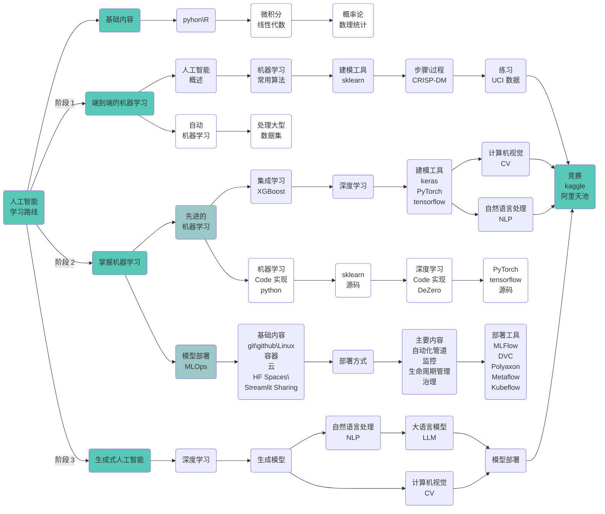

## 学习路径图

  

{}

### 阶段一：端到端的机器学习


  打基础的过程，我们以学习完整的建模过程为主要目标，以了解常用机器算法（优缺点，原理，应用）为次要目标，
  快速熟悉端到端的建模过程。***不要在开始深究某一部分，可以在完成许多完整的建模过程后再去整理其中的每一部分。***


***实践多个案例，熟悉端到端的建模过程，主要内容参考如下：***

1. 人工智能，机器学习，深度学习，统计机器学习等相关概念；
2. 了解常用算法原理。了解算法优缺点，原理，应用即可，不必过多关注数学公式；
3. 选择并学习一个过程。学习建模分步过程，如：[KDD](https://machinelearningmastery.com/what-is-data-mining-and-kdd/)，[Crisp-DM](https://en.wikipedia.org/wiki/Cross_Industry_Standard_Process_for_Data_Mining)，[OSEMN](https://machinelearningmastery.com/how-to-work-through-a-problem-like-a-data-scientist/)等；
4. 选择并学习工具。选择建模工具库。如：[Weka](https://machinelearningmastery.com/how-to-run-your-first-classifier-in-weka/)，[scikit-learn](https://machinelearningmastery.com/a-gentle-introduction-to-scikit-learn-a-python-machine-learning-library/)，[R](https://machinelearningmastery.com/what-is-r/)；
5. 在小数据集上练习。小数据集上练习。如： [UCI ML](http://archive.ics.uci.edu/ml/) 存储库

 

***如果没有接触过编程，统计学，需要预先了解一些基础知识：***

1. 了解编程基础：Python 或 R ;
2. 统计学：描述性统计分析、概率论等；（例，朴素贝叶斯算法需了解条件概率）；

   

### 阶段二：掌握机器学习


  ***深入学习机器学习***，需要一定数学基础（微积分，线性代数）；***部署实践***，需要软件工程技能（Git，Github，云计算，Linux）。
  ***完成深入机器学习后，您将对构建和部署知识和高级 ML 模型有深入的了解。以此为目标，不断完善自己的知识库***。


***掌握先进的机器学习技术：***

1. 通过参竞赛（Kaggle，阿里天池），练习使用机器学习方法解决现实世界的问题；
2. 学习线性代数，微积分，深入研究机器学习基础算法；
3. 从集成学习开始，然后转向深度学习（神经网络及流行框架），迁移学习等；
4. 深入研究深度学习内容，关注自然语言处理 (NLP) 和计算机视觉 (CV)；
   - NLP：处理非结构化文本数据，支持情感分析等应用；
   - CV：从视觉数据中分析和洞察图像识别等应用；

 

***MLOps，机器学习的部署和生命周期管理：***

1. 工程技能：git\github\Linux\容器\云，HF Spaces\Streamlit Sharing；
2. 部署方法：线上，线下;
3. 主要内容：自动化管道，监控，生命周期管理，治理；
4. 主要工具：设计主要内容中使用的相关工具，如开源 MLOps 项目：
   - MLFlow 管理 ML 生命周期，包括实验、可重复性和部署，并包含模型注册表
   - DVC 管理 ML 项目的版本控制，使其可共享和可复制
   - Polyaxon 具有实验、生命周期自动化、协作和部署功能，并包含模型注册表
   - Metaflow 是 Netflix 的一个前项目，用于管理自动化流程和部署
   - Kubeflow 具有在 Kubernetes 容器中实现工作流自动化和部署的功能
  

   

### 阶段三：高级人工智能


  完成第二步的学习，可称为机器学习工程师，能建模，也能部署实践。***作为数据科学家，需要具备解决相关领域的问题，需要理解相关领域的专业知识，也需要具备解决问题的能力，更需要学习新的人工智能技术***。


***领域专业知识和专业应用：***

1. 学习不同领域专业知识；
2. 通过研究竞赛平台多领域数据科学问题，获得***多样化的经验*** 培养 ***解决问题的技能***；

 

***深入研究高级人工智能主题，关注生成模型：***

1. 开始使用，[coze](https://www.coze.com)；
2. NLP 生成模型；
3. CV 生成模型；

{}

   

## 创建投资组合

***以有数据问题的经理或小企业主的心态去评估交付能力：***

1. 如果您需要一个“数据人员”来交付报告或模型，您会考虑什么来评估候选人是否可以交付结果？
  
 

***选择与众不同的新颖项目：***

1. 以 [Kaggle](https://www.kaggle.com/) 和 [阿里天池](https://tianchi.aliyun.com/competition/activeList) 等竞赛网站为起点；
2. 将报告在知乎、掘金等平台展示结果
3. 在 Github 上托管个人博客；
4. 考虑录制一段简短的视频，展示您的发现；

  

## 参考网址：

1. [应用机器学习获得报酬](https://machinelearningmastery.com/ladder-approach-to-becoming-a-machine-learning-consultant/)
2. [2024 年成为数据科学家的学习路径](https://www.analyticsvidhya.com/blog/2020/12/a-comprehensive-learning-path-to-become-a-data-scientist/)
3. [从数据收集到模型部署：数据科学项目的 6 个阶段 - KDnuggets](https://www.kdnuggets.com/2023/01/data-collection-model-deployment-6-stages-data-science-project.html)
4. [全面的 MLOps 学习路径：2024 年版](https://www.analyticsvidhya.com/blog/2023/12/a-comprehensive-mlops-learning-path/)
5. [2024 年学习生成式人工智能的最佳路线图](https://www.analyticsvidhya.com/blog/2023/05/from-novice-to-pro-the-epic-journey-of-mastering-generative-ai/)
6. [MLOps 概述](https://www.kdnuggets.com/2021/03/overview-mlops.html)

