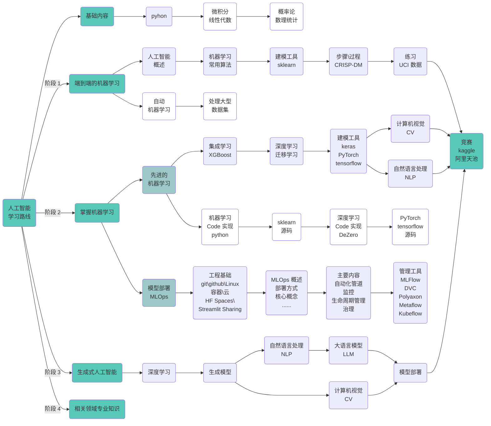
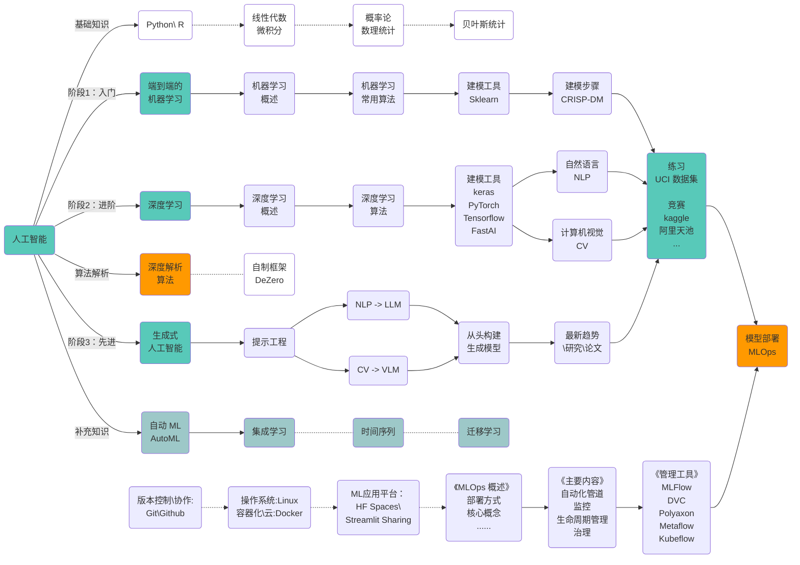

## 学习路径图




```markdown
%%{ init: { 'flowchart': { 'curve': 'bumpX', 'styles': {
   'stroke-width': '1px'
} } } }%%
```


<br><br><br><br><br><br><br><br>


## 学习路径图




A -- AutoML<br>自动机器学习 --> Z


<br><br><br><br><br><br><br><br><br>


## 基础知识


  
  
  
  
  
  



<br><br><br>


## 阶段一：入门训练

### > 端到端的机器学习：


  以学习完整的建模过程为主要目标，以了解常用机器算法（优缺点，原理，步骤，应用）和学习建模工具（`Sklearn`\ `scikit-learn`）为次要目标，
  快速熟悉端到端的建模过程。


<font color=DarkCyan face=Georgia align=right>***实践多个案例，熟悉端到端的建模过程，主要内容参考如下：***</font>

1. 了解人工智能，机器学习，深度学习，统计机器学习等相关概念；
2. 学习常用算法原理。了解算法优缺点，原理，步骤，应用即可，不必过多关注数学公式；
3. 学习建模分步过程。如：[**`CRISP-DM`**](https://www.ibm.com/docs/zh/spss-modeler/saas?topic=dm-crisp-help-overview)；
4. 学习建模工具。如：[**`scikit-learn`**](https://scikit-learn.org/stable/user_guide.html)；
5. 在小数据集上练习。如： [the UC Irvine Machine Learning Repository](https://archive.ics.uci.edu/)；
6. 将模型打包或序列化后的结果部署为 **`Flask API`** 或 **`Streamlit\Gradio`** 应用；

<font color=DarkCyan face=Georgia align=right>***推荐阅读：***</font>

- 《深度学习：从基础到实践》 （上、下册）- [美] Andrew Glassner


<br><br><br>


## 阶段 4：持续学习

<font color=DarkCyan face=Georgia align=right>***持续学习，主要内容参考如下：***</font>

1. [机器学习的最新进展带代码的论文](https://paperswithcode.com/)


<br><br><br><br><br><br><br><br><br><br><br><br>

    C --> C2(集成学习):::someclassA --> C22(集成学习<br>概述) --> C23(集成学习<br>算法) --> C24(集成学习<br>工具) -.- C25(>):::someclassE
    C25 -.-> Y
    
    C --> C3(ML 算法深度解析):::someclassA --> C31(ML 算法<br>Code 实现):::someclassB --> C32(Sklearn<br>源码):::someclassC


<br><br><br>

### 2、集成学习：
<font color=DarkCyan face=Georgia align=right>***学习集成学习，主要内容参考如下：***</font>

1. 了解集成学习相关概念；
2. 学习集成学习常用算法及集成学习方法体系（`Bagging`，`Boosting`，`Stacking`，`Blending`，等）；
3. 学习集成学习 Python 库（`Scikit-learn`，`XGBoost`，`LightGBM`，`CatBoost`）；
4. 练习\实践。如，小数据集 [`UCI ML`](https://archive.ics.uci.edu/) 或 `kaggle` 等；
5. 通过 **`Flask API`** 或 **`Streamlit\Gradio`** 部署应用；

<font color=DarkCyan face=Georgia align=right>***推荐阅读：***</font>

- 《集成学习：基础与算法》 - 周志华，李楠

<br><br><br>

### 3、ML 算法深度解析


  机器学习算法深度解析，需要一定数学基础（线性代数，微积分，概率论与数理统计）。
  从头开始理解机器学习算法将帮助您为任务选择正确的算法，解释结果，解决高级问题，将算法扩展到新应用程序，并提高现有算法的性能。


<font color=DarkCyan face=Georgia align=right>***推荐阅读：***</font>

- 《achine Learning Algorithms in Depth》 - VADIM SMOLYAKOV


<br><br><br>


## 阶段 2：进阶

{}

### 1、时间序列：

<br><br><br>

### 2、深度学习：

<br><br><br>

### 3、NLP：

<br><br><br>

### 4、CV：

<br><br><br>

### 5、DL 算法深度解析

{}


<br><br><br>


## 阶段三：高深

{}

### 1、NLP：

<br><br><br>

### 2、CV：

{}


<br><br><br>


<br><br><br><br><br><br><br><br>

{}


### 阶段二：掌握机器学习


<font color=DarkCyan face=Georgia align=right>***掌握先进的机器学习技术：***</font>

1. 学习线性代数，微积分，深入研究机器学习算法；
2. 从集成学习开始，然后转向深度学习（神经网络及流行框架），迁移学习；
3. 深入研究深度学习，关注自然语言处理 (NLP) 和计算机视觉 (CV)；
4. 通过参竞赛（Kaggle，阿里天池），练习使用机器学习方法解决现实世界的问题；

<br>

<font color=DarkCyan face=Georgia align=right>***MLOps，机器学习的部署和生命周期管理：***</font>

1. 基础知识：`git`\ `github`\ `Linux`\容器化\云，`HF Spaces`\ `Streamlit Sharing`；
2. 部署方式：在线部署：批处理，实时（数据库触发器、发布/订阅、Web 服务、应用内）；离线部署（在本地开发环境、测试环境或内部离线环境中部署批处理，实时处理）；
3. 主要内容：自动化管道，监控，生命周期管理，治理；
4. 核心概念：持续集成与持续部署（CI/CD），版本控制，模型监控；
5. 管理工具：`MLFlow`，`Polyaxon`，`Metaflow`，`Kubeflow`；
  
<br>

<font color=DarkCyan face=Georgia align=right>***推荐书籍：***</font>

- 《统计学习方法》 (第2版) - 李航
- 《机器学习》（西瓜书）- 周志华


<br><br><br>


### 阶段三：高级人工智能


  完成第二步的学习，可称为机器学习工程师，能建模，也能部署实践。***需要学习先进的人工智能技术，生成式人工智能***。


<font color=DarkCyan face=Georgia align=right>***深入研究高级人工智能主题，关注生成模型：***</font>

1. 开始使用，[coze](https://www.coze.com)；
2. NLP 生成模型，LLM（大语言模型）；
3. CV 生成模型；


<br><br><br>


### 阶段四：相关领域专业知识


  ***作为数据科学家，需要具备解决相关领域的问题，需要理解相关领域的专业知识***。


<font color=DarkCyan face=Georgia align=right>***领域专业知识：***</font>

1. 学习不同领域专业知识，如保险，信贷，物流，电商等；
2. 通过研究竞赛平台多领域数据科学问题，获得 ***多样化的经验*** 培养 ***解决问题的技能***；
3. 可以通过收集的行业知识\信息，分析案例，创建行业知识库；


{}

<br><br><br>


## 创建投资组合

<font color=DarkCyan face=Georgia align=right>***选择与众不同的新颖项目创建投资组合：***</font>

1. 以 [Kaggle](https://www.kaggle.com/) 和 [阿里天池](https://tianchi.aliyun.com/competition/activeList) 等竞赛网站为起点；
2. 将报告在微信公众号、知乎、掘金等平台展示结果；
3. 在 Github 上托管个人博客；
4. 考虑录制一段简短的视频，展示您的发现；


<br><br><br>


## 参考网址：

1. [应用机器学习获得报酬](https://machinelearningmastery.com/ladder-approach-to-becoming-a-machine-learning-consultant/)
2. [2024 年成为数据科学家的学习路径](https://www.analyticsvidhya.com/blog/2020/12/a-comprehensive-learning-path-to-become-a-data-scientist/)
3. [从数据收集到模型部署：数据科学项目的 6 个阶段 - KDnuggets](https://www.kdnuggets.com/2023/01/data-collection-model-deployment-6-stages-data-science-project.html)
4. [全面的 MLOps 学习路径：2024 年版](https://www.analyticsvidhya.com/blog/2023/12/a-comprehensive-mlops-learning-path/)
5. [2024 年学习生成式人工智能的最佳路线图](https://www.analyticsvidhya.com/blog/2023/05/from-novice-to-pro-the-epic-journey-of-mastering-generative-ai/)
6. [MLOps 概述](https://www.kdnuggets.com/2021/03/overview-mlops.html)


