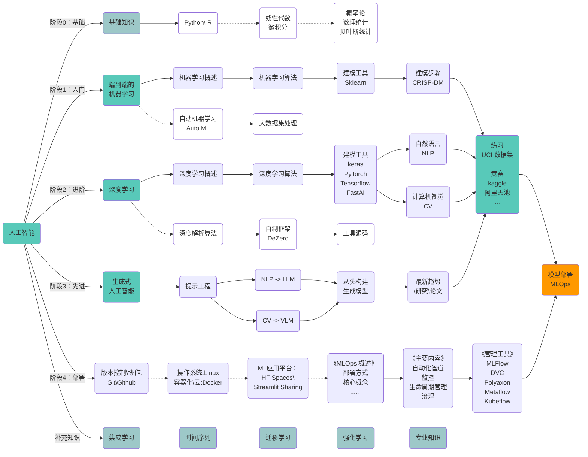









  

## 学习路径

  

## 阶段 0：基础知识


  
  
  
  
  


  

## 阶段 1：端到端的机器学习


  以学习完整的建模过程为主要目标，以了解常用机器算法（优缺点，原理，步骤，应用）和学习建模工具（`Sklearn`\ `scikit-learn`）为次要目标，
  快速熟悉端到端的建模过程。


***实践多个案例，熟悉端到端的建模过程，主要内容参考如下：***

1. 了解人工智能，机器学习，深度学习，统计机器学习等相关概念；
2. 学习常用算法原理。了解算法优缺点，原理，步骤，应用即可，不必过多关注数学公式；
3. 学习建模分步过程。如：[**`CRISP-DM`**](https://www.ibm.com/docs/zh/spss-modeler/saas?topic=dm-crisp-help-overview)；
4. 学习建模工具。如：[**`scikit-learn`**](https://scikit-learn.org/stable/user_guide.html)；
5. 在小数据集上练习。如： [the UC Irvine Machine Learning Repository](https://archive.ics.uci.edu/)；
6. 将模型打包或序列化后的结果部署为 `Flask API` 或 `Streamlit\Gradio` 应用；

***补充内容：***

1. 了解自动化机器学习工具。
2. 了解处理大数据集的 python 库。

***推荐阅读：***

- 《深度学习：从基础到实践》 （上册）- [美] Andrew Glassner
- 《Machine Learning with Python Cookbook》 Chris Albon
- 《machine-learning-mastery-with-python》 Jason Brownlee 
- 《菜菜的机器学习sklearn课堂》
- 《机器学习实战：基于Scikit-Learn和TensorFlow》 （法）奥雷利安·杰龙
- 《Python机器学习》 （美）塞巴斯蒂安·拉施卡（Sebastian Raschka） （美）瓦希德·米尔贾利利（Vahid Mirjalili）

 


  
  
  


   

## 阶段 2：深度学习

***深度学习，主要内容参考如下：***

1. 了解深度学习相关概念；
2. 学习深度学习常用算法及深度学习方法体系（`CNN`，`RNN`，`LSTM`，`Transformer`，等）；
3. 学习深度学习框架\工具（`keras`，`PyTorch`，`Tensorflow`，`FastAI`）；
4. 学习自然语言处理，计算机视觉；
5. 在 KAggle，阿里天池上练习；

***补充内容：***


  机器学习算法深度解析，需要一定数学基础（线性代数，微积分，概率论与数理统计）。
  从头开始理解机器学习算法将帮助您为任务选择正确的算法，解释结果，解决高级问题，将算法扩展到新应用程序，并提高现有算法的性能。


1. 深度解析机器学习算法；
2. 学习深度学习自制框架：DeZero；
3. 学习框架\工具源码；

***推荐阅读：***

- 《深度学习：从基础到实践》 （下册）- [美] Andrew Glassner
- 《深度学习入门基于Python的理论与实现》 - [日] 斋藤康毅
- 《深度学习入门2自制框架》 - [日] 斋藤康毅
- 《深度学习进阶：自然语言处理》 - [日] 斋藤康毅
- 《深度学习入门4：强化学习》 - [日] 斋藤康毅
- --
- 《achine Learning Algorithms in Depth》 - VADIM SMOLYAKOV
- 《统计学习方法》 (第2版) - 李航
- 《机器学习》（西瓜书）- 周志华

   

## 阶段 3：生成式人工智能

***深入研究高级人工智能主题，关注生成模型：***

1. 学习提示工程（专注于创建和改进提示）。如：[coze](https://www.coze.com)；
2. NLP 的生成模型，LLM（大语言模型）；
3. 计算机视觉的生成模型；
4. 了解如何从头开始构建这些生成模型；
5. 了解生成人工智能的最新趋势和研究；

***推荐阅读：***

- [2024 年学习生成式人工智能的最佳路线图](https://www.analyticsvidhya.com/blog/2023/05/from-novice-to-pro-the-epic-journey-of-mastering-generative-ai/)
- [机器学习的最新进展带代码的论文](https://paperswithcode.com/)
- [10 个学习法学硕士的免费资源](https://www.kdnuggets.com/10-free-resources-to-learn-llms)

   

## 阶段 4：模型部署

***MLOps，机器学习的部署和生命周期管理：***

1. 基础知识：`git`\ `github`\ `Linux`\容器化\云，`HF Spaces`\ `Streamlit Sharing`；
2. 部署方式：在线部署：批处理，实时（数据库触发器、发布/订阅、Web 服务、应用内）；离线部署（在本地开发环境、测试环境或内部离线环境中部署批处理，实时处理）；
3. 主要内容：自动化管道，监控，生命周期管理，治理；
4. 核心概念：持续集成与持续部署（CI/CD），版本控制，模型监控；
5. 管理工具：`MLFlow`，`Polyaxon`，`Metaflow`，`Kubeflow`；

***推荐阅读：***

- [成为 MLOps 工程师所需的唯一免费课程：MLOps Zoomcamp](https://www.kdnuggets.com/the-only-free-course-you-need-to-become-a-mlops-engineer)
- [掌握 MLOps 的 10 个 GitHub 存储库](https://www.kdnuggets.com/10-github-repositories-to-master-mlops)

   

## 补充知识

### 1、集成学习

***主要内容参考如下：***

1. 了解集成学习相关概念；
2. 学习集成学习常用算法及集成学习方法体系（`Bagging`，`Boosting`，`Stacking`，`Blending`，等）；
3. 学习集成学习 Python 库（`Scikit-learn`，`XGBoost`，`LightGBM`，`CatBoost`）；
4. 练习\实践。如，小数据集 [`UCI ML`](https://archive.ics.uci.edu/) 或 `kaggle` 等；
5. 通过 **`Flask API`** 或 **`Streamlit\Gradio`** 部署应用；

***推荐阅读：***

- 《集成学习：基础与算法》 - 周志华，李楠

   

### 2、领域专业知识


  ***作为数据科学家，需要具备解决相关领域的问题，需要理解相关领域的专业知识***。


***领域专业知识：***

1. 学习不同领域专业知识，如保险，信贷，物流，电商等；
2. 通过研究竞赛平台多领域数据科学问题，获得 ***多样化的经验*** 培养 ***解决问题的技能***；
3. 可以通过收集的行业知识\信息，分析案例，创建行业知识库；

   

## 创建投资组合

***选择与众不同的新颖项目创建投资组合：***

1. 以 [Kaggle](https://www.kaggle.com/) 和 [阿里天池](https://tianchi.aliyun.com/competition/activeList) 等竞赛网站为起点；
2. 将报告在微信公众号、知乎、掘金等平台展示结果；
3. 在 Github 上托管个人博客；
4. 考虑录制一段简短的视频，展示您的发现；

   

## 参考网址：

1. [应用机器学习获得报酬](https://machinelearningmastery.com/ladder-approach-to-becoming-a-machine-learning-consultant/)
2. [2024 年成为数据科学家的学习路径](https://www.analyticsvidhya.com/blog/2020/12/a-comprehensive-learning-path-to-become-a-data-scientist/)
3. [2024 年学习生成式人工智能的最佳路线图](https://www.analyticsvidhya.com/blog/2023/05/from-novice-to-pro-the-epic-journey-of-mastering-generative-ai/)
4. [从数据收集到模型部署：数据科学项目的 6 个阶段 - KDnuggets](https://www.kdnuggets.com/2023/01/data-collection-model-deployment-6-stages-data-science-project.html)
5. [全面的 MLOps 学习路径：2024 年版](https://www.analyticsvidhya.com/blog/2023/12/a-comprehensive-mlops-learning-path/)
6. [MLOps 概述](https://www.kdnuggets.com/2021/03/overview-mlops.html)

