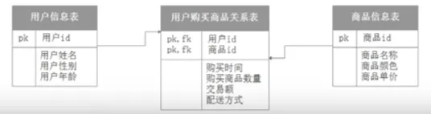
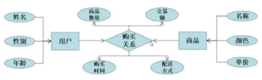

## 1. 什么是 ER 模型？

ER (Entity-Relationship) ***实体关系模型***，是数据库设计的图形化表示方法，由Peter Chen于1976年提出，用于描述现实世界中的数据关系。

 

## 2. 核心三要素

1. 实体：数据对象（现实世界中可区分的对象）示例：学生、课程、教师
2. 属性：对象的修饰（实体的特征）示例：学号、姓名、成绩
3. 关系：实体之间的联系，示例：选课、授课、管理  

 

## 3. 实践案例

案例：电商购物系统中，对商品、用户设计 ER 实体关系模型图，表示业务联系，如何实现？

 

  

  

## 参考网址：

1. [【入门精讲】数据仓库原理&实战 - 哈喽鹏程](https://www.bilibili.com/video/BV1qv411y7Wv/?spm_id_from=333.337.search-card.all.click)

