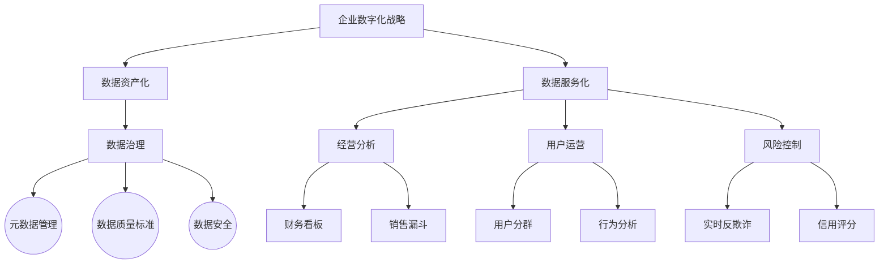
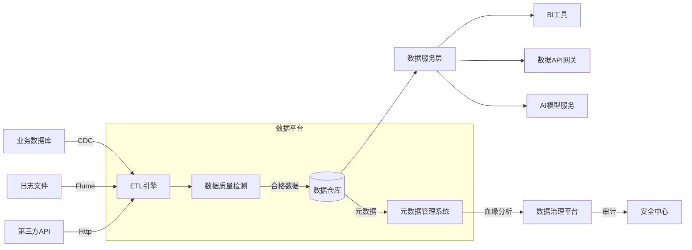
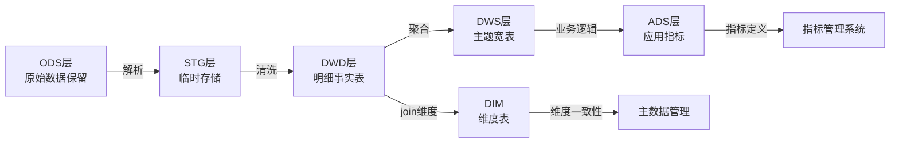
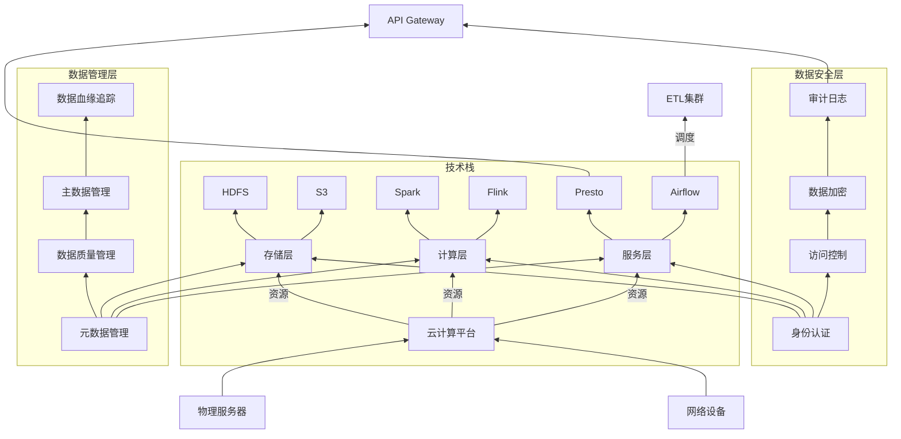
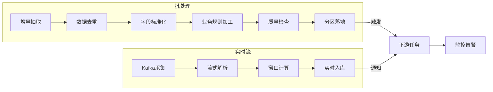
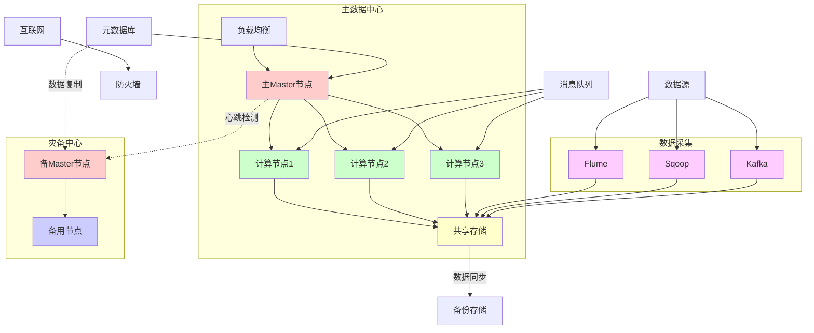
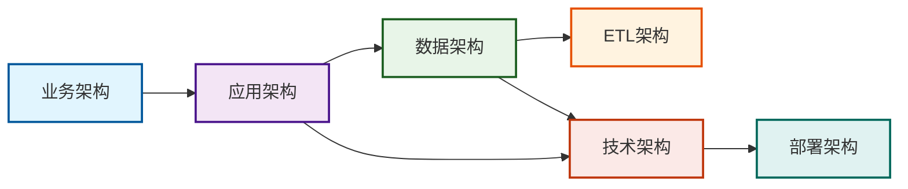
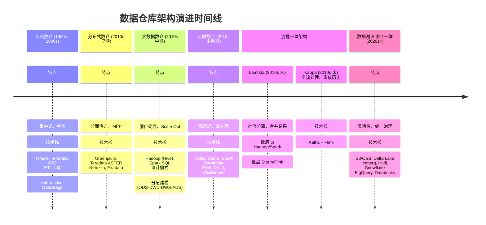

## 1. 架构概述

| 架构维度          | 定位                     | 核心任务                                                                 | 关键交付物                  | 依赖关系                     |
|:-------------------:|:--------------------------:|--------------------------------------------------------------------------|:-----------------------------:|:------------------------------:|
| **业务架构** （战略层） | 为什么建数仓？ （价值定义） | - 明确组织真实诉求（数据资产/数据应用） - 识别服务对象（高管/业务部门） - 制定数据战略目标 | 业务需求说明书 数据治理框架 | 驱动所有其他架构设计         |
| **应用架构** （战术层） | 如何实现业务需求？ （系统蓝图） | - 功能模块划分：  ▪ 数据接入层  ▪ 数据存储层  ▪ 管理工具（元数据/质量监控）  ▪ 数据服务层（BI/API） | 系统架构图 接口规范文档  | 承接业务需求 约束数据模型设计 |
| **数据架构** （模型层） | 数据如何结构化？ （逻辑设计） | - 分层建模（ODS→DWD→DWS→ADS） - 主题域划分（如销售、供应链） - 标准化定义（字段命名/计算口径） | 数据模型ER图 数据字典    | 受应用功能约束 指导ETL开发 |
| **技术架构** （实现层） | 如何技术落地？ （工具选型） | - 技术栈选型（Hadoop/云数仓） - 组件集成（Spark+Kafka+Airflow） - 性能优化（索引/缓存策略） | 技术方案书 系统拓扑图    | 支撑数据模型 决定部署方案 |
| **ETL架构** （流水线层） | 数据如何加工？ （流程设计） | - 处理流程（抽取→转换→加载） - 任务调度（依赖关系/优先级） - 容错处理（重试/报警机制） | ETL流程图 调度配置表     | 实现数据模型 依赖技术组件 |
| **部署架构** （物理层） | 系统如何安装？ （资源配置） | - 环境规划（开发/测试/生产） - 硬件配置（服务器/存储/网络） - 高可用部署（集群/容灾） | 部署方案书 资源清单      | 依赖技术选型 保障系统运行 |

 

## 2. 架构详述

### 2.1、业务架构（战略层）

1️⃣ 定义：***描述数据仓库如何支持业务目标和业务流程***。

2️⃣ 关键要素：
1. ***业务目标对齐***：明确数据仓库要解决的业务问题
2. 利益相关者分析：识别业务用户、决策者等角色
3. KPI体系：确定关键绩效指标和度量标准
4. ***数据治理框架***：数据所有权、质量标准等
5. 价值流分析：数据如何为业务创造价值

3️⃣ 关键交付物：***业务需求说明书***，***数据治理框架***

 

### 2.2、应用架构（战术层）

1️⃣ 定义：***描述数据仓库系统中的功能模块和应用组件***。

2️⃣ 关键要素：
- 功能模块划分：
  1. 数据采集
  2. 数据处理
  3. 数据存储
  4. 数据分析
  5. 数据服务

- 应用组件：
  1. ETL/ELT工具
  2. BI工具
  3. 报表系统
  4. 数据挖掘工具
  5. 数据目录

3️⃣ 关键交付物：系统架构图，接口规范文档。

 

### 2.3、数据架构（模型层）

1️⃣ 定义：***描述数据的组织、结构和流动***。

2️⃣ 关键要素：
- 数据分层：
  1. ODS (操作数据存储)
  2. DWD (数据仓库明细层)
  3. DWM (数据仓库中间层)
  4. DWS (数据仓库汇总层)
  5. ADS (应用数据服务层)

- 数据模型：
  1. 星型模型
  2. 雪花模型
  3. 星座模型
  4. 数据宽表

3️⃣ 数据生命周期管理

4️⃣	主数据管理

5️⃣ 元数据管理

6️⃣ 数据质量框架

7️⃣ 数据模型ER图，数据字典

 

### 2.4、技术架构（实现层）

1️⃣ 定义：***描述实现数据仓库的技术组件和基础设施***。

2️⃣ 关键要素：

| 分类              | 工具/技术                                                                 |
|-------------------|--------------------------------------------------------------------------|
| 技术栈选择         | 传统RDBMS (Oracle, Teradata) 大数据平台 (Hadoop, Spark) 云数据仓库 (Snowflake, Redshift, BigQuery) |
| 计算与处理框架     | 批处理引擎 (MapReduce，Spark) 流处理引擎 (Flink, Storm) 查询引擎 (Presto, Druid) |
| 存储技术           | 关系型数据库 (MySQL, PostgreSQL) NoSQL数据库 (MongoDB, Cassandra) 数据湖存储 (S3, HDFS) |
| 数据管理           | 数据质量 (Great Expectations) 元数据 (Atlas, DataHub) 主数据 (Informatica MDM) |
| 安全架构           | 认证授权 (Kerberos, IAM) 数据加密 (TLS, KMS) 审计日志 (Audit Logging) |

 

### 2.5、ETL 架构（流水线层）

1️⃣ 定义：***描述数据抽取、转换和加载的过程设计***。

2️⃣ 关键要素：

| 分类 | 工具/技术 |
|---|---|
| 抽取策略 | 全量抽取 增量抽取 (CDC) 实时流式抽取 |
| 转换逻辑 | 数据清洗 数据标准化 数据聚合 业务规则应用 |
| 加载策略 | 批量加载 微批处理 实时加载 |
| 调度框架 | 工作流设计 依赖管理 错误处理 重试机制 |

 

### 2.6、部署架构（物理层）

1️⃣ 定义：***描述数据仓库系统的物理或虚拟部署方案***。

2️⃣ 关键要素：

| 分类 | 工具/技术 |
|---|---|
| 环境规划 | 开发环境 测试环境 预生产环境 生产环境 |
| 部署模式 | 本地部署 云部署 混合部署 |
| 资源分配 | 计算资源分配 存储资源分配 网络配置 |
| 高可用设计 | 集群部署 故障转移 灾备方案 |
| 扩展性设计 | 水平扩展 垂直扩展 弹性伸缩 |
| 容器化方案 | Docker Kubernetes编排 |

 

## 3. 架构间关系

***架构间关系总结（依赖与影响）***

- 业务架构是核心驱动力，直接影响应用架构和数据架构。
- 应用架构决定系统功能划分，并依赖数据架构提供数据支持。
- 数据架构需要技术架构提供存储和计算能力，并指导ETL架构的数据加工逻辑。
- 技术架构决定部署架构的硬件/云资源分配。
- ETL架构是数据流动的管道，连接数据架构和技术架构。
- 部署架构是最终落地，确保所有组件高效稳定运行。

***核心依赖路径：***

- 业务架构 → 应用架构：业务需求驱动应用功能设计
- 应用架构 → 数据架构：应用需求决定数据模型结构
- 数据架构 → ETL架构：数据模型指导ETL开发流程
- 技术架构 → 部署架构：技术选型决定部署方案

***交叉依赖关系：***

- 应用架构 → 技术架构：应用特性影响技术选型
- 数据架构 → 技术架构：数据规模影响技术方案
- ETL架构 → 技术架构：ETL流程依赖技术组件

***各架构职责：***

- 业务架构：定义为什么做（战略层）
- 应用架构：定义做什么（战术层）
- 数据架构：定义数据如何组织（设计层）
- ETL架构：定义数据如何加工（执行层）
- 技术架构：定义用什么技术（支撑层）
- 部署架构：定义如何部署实施（物理层）

 

## 4. 数据架构\数仓架构

### 4.1、数仓架构发展

| 架构阶段 | 核心诉求 | 关键技术 | 优点 | 缺点 |
|---------|---------|----------|------|------|
| **传统数仓** | 集中式管理、BI报表 | Teradata、Oracle、ETL工具 | 强一致性、SQL支持好、稳定 | 扩展性差、成本极高、无法处理非结构化数据 |
| **分布式数仓** | 处理更大数据量 | Greenplum、Netezza (MPP架构) | 性能比传统数仓强、兼容性好 | 扩展仍有上限、成本依然较高 |
| **大数据数仓** | 处理海量多源数据、降低成本 | Hadoop、Hive、Spark | scale-out扩展性强、成本低 | 延迟高（T+1）、技术栈复杂、数据质量挑战大 |
| **实时数仓** | 低延迟、实时分析与决策 | Kafka、Flink、ClickHouse、Druid | 延迟低至秒/毫秒级、实时业务价值 | 架构复杂（需对接批和实时两条链路）、数据口径可能不一致 |
| **Lambda架构** | 兼顾实时与历史数据的准确性 | **批层**：Hadoop/Spark **速层**：Flink/Storm **服务层**：Druid | 平衡准确性与实时性 | 两套代码、开发运维成本高、需要合并批流结果 |
| **Kappa架构** | 简化Lambda的复杂性 | Kafka（存储历史数据）、Flink | 一套代码处理批和流、架构简化 | 消息队列历史数据重处理成本高、对消息队列要求高 |
| **数据湖** | 数据民主化、探索式分析 | S3/OSS、Hudi、Iceberg、Delta Lake | 原始数据存储、灵活性极高、支持多种计算引擎 | 缺乏强Schema管理、易变成"数据沼泽"、事务支持弱 |
| **湖仓一体** | 融合湖的灵活与仓的管理 | **存储层**：S3/OSS **管理层**：Delta/Iceberg **计算层**：Spark/Flink | 最佳平衡点：兼具灵活性、性能、成本和管理 | 技术仍在快速发展中、架构复杂度较高 |

