## 1. 为什么要构建数据仓库？

### 1.1、历史问题

- ***历史数据积存***：历史数据使用频率低，堆积在业务库中，导致性能下降。
- ***数据使用困难***：各个部门自己建立独立的抽取系统，导致数据不一致，且使用效率低。

 

- 业务系统常见问题：

  1. 业务系统的表结构为事务处理性能而优化，有时并不适合查询与分析。
  2. 某些业务数据由于安全或其他因素不能直接访问；
  3. 业务系统多，数据格式多元化（如日期、数字格式不统一）；
  4. 业务系统的列名通常是硬编码，有时仅仅是无意义的字符串，这让编写分析系统更加困难；
  5. 没有适当的方式将有价值的数据合并进特定应用的数据库。
  6. 没有适当的位置存储元数据。
  7. 通常事务处理的优先级比分析系统高，所以如果将分析系统和事务处理运行在同一硬件之上，分析系统往往性能很差。
  8. 有误用业务数据的风险。
  9. 用户需要看到的显示数据字段，有时在数据库中并不存在。

 

- 业务系统版本问题：
  
  1. 业务系统的版本变更很频繁，每次变更都需要重写分析系统并重新测试；
  2. 数据来源于多个业务系统版本的报表，很难建立和维护；

 

### 1.2、业务驱动因素

- ***决策支持：*** 公司业务对于数据的实时性越来越迫切，需要有实时数据来辅助完成决策。
- ***合规需求：*** 随着数据监管法规（如 GDPR、CCPA、《数据安全法》）的加强，企业必须确保数据的准确性，可审计性，时效性等。
- ***商务智能：*** 商务智能为组织、客户及产品提供洞察。是建设数仓的主要原因。通过 ***商务智能获得决策知识，能提升公司运营效率，增强其竞争优势***。数据使用速度加快，商务智能从回顾性评价发展到预测分析领域。

 

### 1.3、技术进步

- 数据平台工具对整体实时开发的支持也日渐趋于成熟，开发成本降低。
- 尽管需要增加软硬件的投入，但建立独立数据仓库与直接访问业务数据相比，无论是成本还是带来的好处，这样做都是值得的。

  

## 2. 什么是数据仓库？

### 2.1、定义

1. 简单来说，数据仓库就是一个 ***支持决策的数据池***，同时还是管理者可能感兴趣的企业 ***当前和历史数据的存储库***。通常数据被组织成分析处理可用的形式（例如在线分析处理、数据挖掘、查询、报表和其他支持决策的应用）。

 

2. 数据仓库，是一个用来 ***支持管理者决策***（Decision Making Support）、***面向主题的***（Subject Oriented）、***集成的***（Integrate）、***非易失/稳定的***（Non-Volatile）、***随时间变/化反映历史变化的***（Time Variant）数据集合。主要用于组织积累的历史数据，并使用分析方法（OLAP、数据分析）进行整理，进而辅助决策，为管理者、企业系统提供数据支持，构建商务智能（BI）和决策支持系统（decision support system/DDS）。

 

### 2.2、特点

#### 1️⃣ 面向主题的

传统数据库中，最大的特点是面向应用进行数据的组织，各个业务系统可能是相互分离的。

数仓为数据分析提供服务，***根据主题组织将原始数据集合在一起。面向主题（销售、客户、财务、人员、生产），用户可以确定业务如何开展***，以及为什么要这样开展。面向主题它提供了一个对企业进行更加全面分析的视觉。

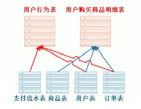

 

#### 2️⃣ 集成的

集成与面向主题密切相关。原始数据来源于不同数据源（分散、独立、异构的数据库），***要整合成最终数据，需要经过抽取、清洗、转换的过程，最终将不同数据源的数据以一致（命名冲突、计量单位差异等）的格式存储***    。

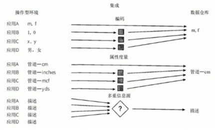

 

#### 3️⃣ 非易失

数据仓库 ***保存的数据是一系列历史快照，不允许被修改，只允许通过工具进行查询、分析***。过时的数据将会被抛弃，而更新的数据则作为新数据被记录下来。

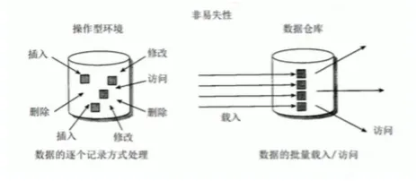

 

#### 4️⃣ 时变性

数仓会 ***定期接受、集成新的数据，从而反应出数据的最新变化***。（每天同步一次）每个数仓都具有时间属性，时间是所有数据仓库都支持的一个重要维度。在数据仓库中，用于分析的多元数据包括不同的时间点（如日、周和月等）。

 

上述这些特点是数据仓库非常便于数据访问。此外，数据仓库还有一些其他特点:

5️⃣ ***基于网络***：数据仓库通常被用来为基于网络的应用提供高效的计算环境。 
6️⃣ ***关系的/多维的***：数据仓库常常是基于关系结构或多维结构。（参考 Romero 和 Abello 的文章）。 
7️⃣ ***客户端/服务器***：数据仓库运用客户端/服务器架构为终端用户提供更轻松便捷的访问。 
8️⃣ ***实时的***：新型的数据仓库已经具备提供实时或动态的数据访问和分析能力。 
9️⃣ ***元数据***：数据仓库通过元数据（即关于数据的数据）来描述数据的组成方式，以及如何有效的使用数据。 

 

### 2.3、作用

1. 以统一的形式存储数据，并以一种易于理解的形式提供给使用者，可以一览公司业务的实时状态，并快速识别问题，这是解决问题的首要步骤，也是最重要的一步。
   
2. 科学的数仓能够持续高效的为业务分析服务，可以帮助企业，**改进业务流程**、**提升运营效率**、**提高产品质量**等。
   
3. 为企业制定决策，提供数据支持，检测趋势、偏差和长期关系以便进行预测与比较，从而**支持业务决策**。

- 综合应用 ***实时数据仓库***（real-time data warehouse/RDW），***决策支持系统***（Decision support system/DDS）和 ***商务智能（BI）*** 技术是实施业务的一种重要手段。

 

### 2.4、目标

参考：《DAMA 数据管理知识体系指南》原书第2版

1. 支持决策分析：核心目标是提供一致、集成的历史数据，支撑企业级分析。

2. 消除信息孤岛
   
3. 提升数据质量

4. 分离 OLTP 与 OLAP

5. 支撑数据资产化

6. 满足合规要求

 

### 2.5、历史

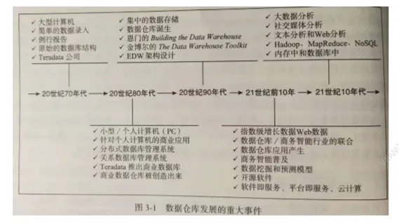

- 萌芽阶段（1978-1988年）将业务处理系统和分析系统分开。
- 探索阶段（1988年左右）DEC公司提出TA2规范，定义分析系统的四个部分：数据获取、数据访问、目录和用户服务。
- 雏形阶段（1988年左右）IBM，信息仓库，数据抽取、转换、有效性验证、加载、Cube 开发、图像化查询工具。
- 确立阶段（1991年）比尔-恩门，《Building the Data Warehouse》，数据仓库之父

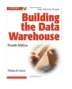

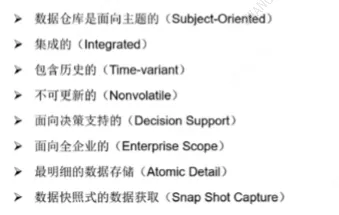

- 确立阶段（1994年）拉尔夫-金博尔《The DataWarehouse Toolkit》，维度建模。

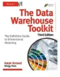

- 争吵与混乱（1996-1997年）比尔-恩门 & 拉尔夫-金博尔

- 合并阶段（1998-2001年）比尔-恩门提出 ***CIF 架构***：数仓分层，不同层采取不同的建模方式。

 

### 2.6、内容


 ***数据仓库 ≠ 仅技术工具***


- 数据仓库不仅仅是 SQL脚本、编程语言或ETL工具的使用

 

- 核心在于：

    - 业务理解（业务流程、指标口径、分析需求）
    - 数据建模能力（维度建模、星型/雪花模型、数据分层）
    - 架构设计（ODS → DWD → DWS → ADS 分层设计）

 

- 数据仓应用库三大核心内容： 
    | 模块                   | 关键内容                                                                 | 示例                          |
|------------------------|--------------------------------------------------------------------------|-------------------------------|
| **数据存储与管理**      | - 数据分层（ODS/DWD/DWS/ADS） - 维度建模（事实表、维度表） - 数据质量监控       | Hive、HDFS、Iceberg、ClickHouse |
| **数据采集与计算（ETL）** | - 数据抽取（Extract） - 数据清洗转换（Transform） - 数据加载（Load） - 实时/离线调度 | Flink、Kafka、Airflow、DataX    |
| **数据应用（BI/分析）**  | - 报表开发 - 即席查询（Ad-hoc） - 数据挖掘（预测模型） - 数据服务API           | Tableau、Superset、机器学习平台  |

  

## 3. 数据仓库 vs 数据库

| 对比维度         | 数据仓库 (Data Warehouse)                     | 数据库 (Database)                     |
|:------------------:|:---------------------------------------------:|:--------------------------------------:|
| **设计目的**     | 面向事务 属于 OLTP（在线事务处理）系统 |  面向主题/分析 属于 OLAP（在线分析处理）系统 |
| **典型应用**     | 面向高层管理人员的，为其提供决策支持；   长期信息需求、为分析数据\数据挖掘而设计；   ***报表系统、多维分析、决策支持系统...***| 面相业务处理人员日常操作，为捕获数据设计；  为业务处理人员提供信息处理的支持；   ***管理系统、交易系统、在线应用...*** |
| **数据特性**     | 集成、历史  只读   延迟（ETL处理后可用）   数据是静态的历史数据，只能定期添加、刷新 | 当前   可更新    实时     数据是动态变化的，只要有业务发生，数据就会被更新 |
| **数据规模**     | TB~PB级                                     | GB~TB级                              |
| **数据结构**     | 星型/雪花模型（维度建模）                     | 关系模型（3NF规范化）                  |
| **典型操作**     | 复杂查询、全表扫描                           | 增删改查、索引查询                    |
| **响应时间**     | 秒~分钟级                                   | 毫秒~秒级                            |
| **用户类型**     | 数据分析师、决策者                           | 业务操作人员、开发人员                |
| **更新频率**     | 定时批量加载（T+1/小时级）                   | 实时更新                             |
| **典型技术**     | Hive/Redshift/Snowflake                     | MySQL/Oracle/SQL Server              |
| **存储成本**     | 高（保留多年历史数据）                       | 中（主要存储当前数据）                |
| **查询复杂度**   | 多表关联、聚合运算                           | 简单条件查询                        |

  

## 4. OLTP vs OLTP

| **对比维度**       | **OLAP (联机分析处理)**                     | **OLTP (联机事务处理)**               |
|--------------------|--------------------------------------------|--------------------------------------|
| **设计目的**       | 支持复杂分析决策                           | 支持日常业务操作                     |
| **数据特性**       | 集成、历史、只读                           | 当前、可更新                         |
| **典型操作**       | 复杂查询、多表关联、聚合计算                | 简单的增删改查操作                   |
| **响应时间要求**   | 秒级到分钟级                               | 毫秒级                               |
| **数据模型**       | 星型/雪花模型                              | 关系模型(3NF)                        |
| **数据规模**       | TB到PB级                                   | GB到TB级                             |
| **用户类型**       | 数据分析师、决策者                         | 业务操作人员、前端应用               |
| **查询模式**       | 不固定、ad-hoc查询                         | 固定模式、预定义查询                 |
| **数据更新方式**   | 批量加载(ETL)                              | 实时单条记录更新                     |
| **索引使用**       | 位图索引、列存储                           | B树索引、哈希索引                    |
| **典型技术**       | Snowflake、Redshift、ClickHouse、Doris           | MySQL、PostgreSQL、Oracle            |
| **并发量**         | 低到中(10-100)                             | 高(1000+)                           |
| **事务特性**       | 不需要ACID                                 | 严格遵循ACID                        |
| **典型场景**       | 月度销售分析、客户行为分析                 | 订单处理、账户余额查询               |

关键差异图解

 

### 4.1、OLTP 联机事物处理

***OLTP***（On-Line Transaction Processing）是面向 ***高并发事务处理***的数据库系统，主要特征包括：
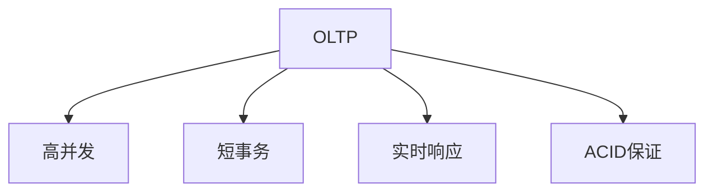

 

***主流 OLTP 数据库***

| **类型**       | **代表产品**                  | **适用场景**              |
|----------------|-----------------------------|-------------------------|
| 关系型         | MySQL, PostgreSQL, Oracle   | 通用业务系统             |
| 分布式         | CockroachDB, TiDB           | 高扩展需求               |
| 内存数据库     | Redis, MemSQL               | 极致性能场景             |

 

***OLTP 联机事物处理存在许多不便，具体如下：***

1. 数据过于分散。存放在多个数据库，甚至是异构数据。

2. 标准规则及编码不统一。不同业务系统间不统一，甚至单个业务系统不同时间段间也可能不统一。

3. 数据质量问题。会有部分垃圾数据、测试数据、系统 bug 等产生的错误数据，都会影响到数据质量。

4. 历史数据缺失。通常只会保留最近半年到一年左右数据，历史数据会被转移甚至删除。

5. 对业务系统性能的影响。过量的分析计算会抢占计算资源。

6. 面向 OLTP 的数据存储，有时候并不适合数据分析。


 为了更好的支持各种数据应用，上世纪 90 年代初，***联机分析处理***（On-Line Analysis Processing）***及数据仓库*** （Data Warehouse）的概念应运而生。


 

### 4.2、OLAP 联机分析处理

OLAP（On-Line Analysis Processing）联机分析处理：联机分析处理的概念最早由关系数据库之父 E．F．Codd 于 1993 年提出。Codd 提出了 ***多维数据库*** 和 ***多维分析***的概念，把业务系统面向业务逻辑、面向事务增删改查而设计的存储结构，转换成面向分析、侧重查询的多维分析型存储结构。

#### 1️⃣ 维度,属性,度量

多维分析将所有对象都抽象为维度、度量、属性三类：

| 要素类型 | 定义                          | 业务意义                     | 技术特征                     |
|----------|-------------------------------|-----------------------------|----------------------------|
| **维度** | 分析视角/观察角度              | 确定"按什么分析"             | 通常作为GROUP BY字段        |
| **属性** | 维度的描述性特征               | 定义"这个视角的具体分类"      | 维度表的列                  |
| **度量** | 可计算的数值指标               | 回答"分析结果是多少"          | 聚合函数(SUM/AVG等)操作对象 |

零售行业维度分析\建模示例如下：

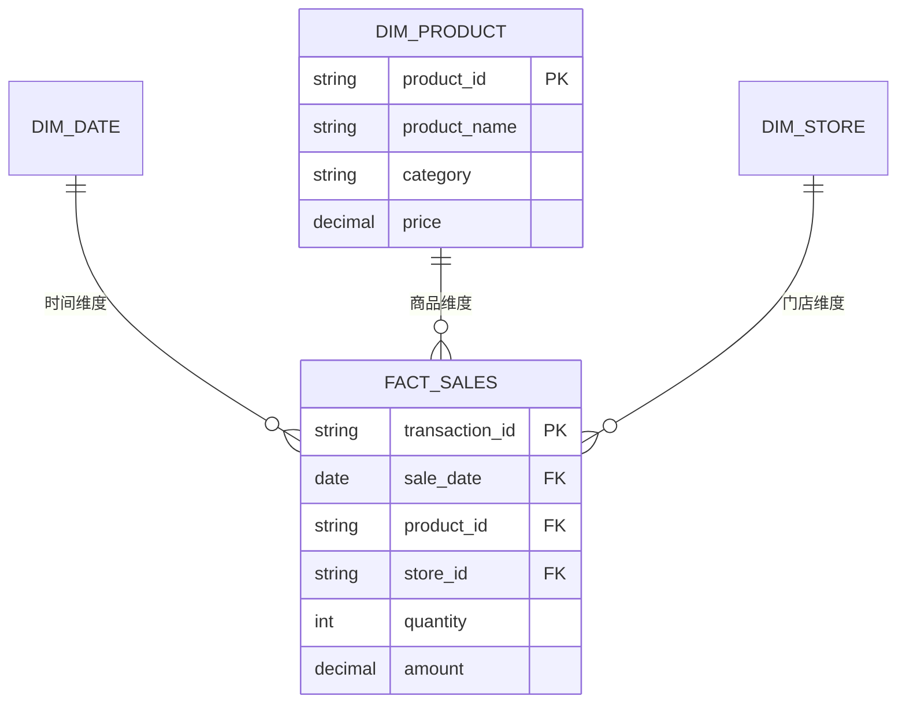

 

#### 2️⃣ R\M\HOLAP

OLAP 可细分为 ROLAP ， MOLAP ， HOLAP 三类

| **对比维度**       | **ROLAP**                          | **MOLAP**                          | **HOLAP**                          |
|:------------------:|:---------------------------------:|:------------------------------------:|:------------------------------------:|
| **全称**           | Relational OLAP                    | Multidimensional OLAP              | Hybrid OLAP                        |
| **定义**           | 基于关系型数据库实现的OLAP | 通过预计算多维数据立方体(Cube)实现的OLAP | 混合ROLAP和MOLAP的实现方式|
| **存储结构**       | 关系型数据库(星型/雪花模型)         | 专有多维数组(Cube)                 | 混合存储(关系型+Cube)              |
| **数据粒度**       | 存储原始明细数据                   | 只存储预聚合数据                   | 热数据Cube+冷数据关系存储          |
| **查询性能**       | 中等(依赖SQL优化)                  | 极快(毫秒级响应)                   | 热数据快/冷数据中等                |
| **存储效率**       | 高(关系型压缩)                     | 低(存在维度爆炸)                   | 中(智能分层存储)                   |
| **维度灵活性**     | 高(支持动态增加维度)               | 低(需预定义维度)                   | 热数据固定/冷数据灵活              |
| **更新延迟**       | 近实时(分钟级)                     | 批量更新(小时/天级)                | 热数据延迟/冷数据实时              |
| **明细查询支持**   | ✔️ 完整支持                        | ❌ 不支持                          | ✔️ 仅冷数据支持                    |
| **预计算开销**     | 部分预聚合                         | 全量预计算                         | 按需预计算                        |
| **典型工具**       | Snowflake, StarRocks               | Apache Kylin, SSAS                 | ClickHouse, Azure Analysis Services|
| **最佳适用场景**   | 即席分析/需要明细数据                | 固定报表/高频聚合查询               | 混合工作负载环境                  |
| **缺点**          | ❌ 查询性能中等                     | ❌ 维度爆炸风险                     |❌ 架构复杂                      |

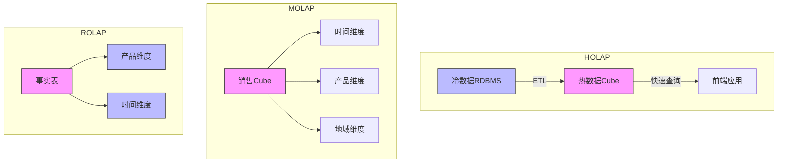

 

#### 3️⃣ OLAP 工具

##### 完整OLAP工具矩阵

| 类型  | 商业工具 | 开源工具 | 核心特点 | 代表用户 | 
|-------|----------|----------|----------|----------|
| **ROLAP** | 1. Snowflake 2. Amazon Redshift 3. Google BigQuery 4. Teradata 5. Vertica 6. IBM Db2 Warehouse 7. Exasol 8. SAP HANA | 1. Apache Doris 2. StarRocks 3. Presto/Trino 4. Druid 5. Greenplum 6. PostgreSQL Citus 7. Materialize 8. TiDB | • 基于关系型存储 • 完整SQL支持 • 保留明细数据 • 支持实时更新 • 灵活分析能力强 | • Snowflake: 可口可乐 • Redshift: Airbnb • Doris: 京东 • StarRocks: 腾讯 | 
| **MOLAP** | 1. Microsoft SSAS 2. Oracle Essbase 3. IBM Cognos TM1 4. SAS OLAP 5. MicroStrategy 6. Pentaho Mondrian 7. AtScale | 1. Apache Kylin 2. Druid 3. ClickHouse 4. Pinot 5. Cube.js 6. Kyligence CE | • 预计算多维Cube • 亚秒级响应 • 维度建模复杂 • 适合固定模式分析 • 存储开销大 | • SSAS: 沃尔玛 • Kylin: 美团 • Druid: Netflix | 
| **HOLAP** | 1. SAP BW/4HANA 2. MicroStrategy 3. SAS OLAP 4. Oracle OLAP 5. IBM Planning Analytics | 1. ClickHouse 2. StarRocks 3. Apache Doris 4. Greenplum 5. MonetDB | • 混合存储架构 • 自动路由查询 • 热数据加速 • 冷数据归档 • 资源利用率高 | • ClickHouse: 字节跳动 • SAP BW: 西门子 • Greenplum: 阿里云 | 

##### 商业工具对比

| **类型** | **代表商业工具** | **开发商** | **核心优势** | **许可模式** | **最新版本** |
|----------|------------------|------------|--------------|--------------|--------------|
| ROLAP | Snowflake Amazon Redshift | Snowflake Inc Amazon | 云原生、弹性扩展 | 按量付费 | Snowflake 7.0 Redshift 3.0 |
| MOLAP | Microsoft SSAS Oracle Essbase | Microsoft Oracle | 深度Office集成 企业级功能 | 商业许可 | SSAS 2022 Essbase 21c |
| HOLAP | SAP BW/4HANA MicroStrategy | SAP MicroStrategy | ERP深度集成 可视化强大 | 商业许可 | BW/4HANA 2.0 MicroStrategy 2023 |

##### 开源工具对比

| **工具** | **类型** | **开发语言** | **核心特性** | **适用数据规模** | **知名用户** |
|----------|----------|--------------|--------------|------------------|--------------|
| Apache Doris | ROLAP | C++ | MPP架构、MySQL协议兼容 | TB~PB | 美团、京东 |
| StarRocks | HOLAP | Java/C++ | 向量化引擎、存算分离 | PB级 | 腾讯、小米 |
| Apache Kylin | MOLAP | Java | Hadoop生态集成、Cube预计算 | TB级 | eBay、滴滴 |
| ClickHouse | HOLAP | C++ | 列式存储、物化视图 | TB~PB | 字节跳动、Cloudflare |
| Druid | MOLAP/ROLAP | Java | 实时摄入、时间序列优化 | TB级 | Netflix、阿里巴巴 |

##### 性能指标对比

| **工具** | 查询延迟(简单聚合) | 查询延迟(多表JOIN) | 数据摄入速度 | 最大集群规模 | 并发能力 |
|----------|-------------------|--------------------|--------------|--------------|----------|
| Apache Doris | 0.5s | 3s | 50MB/s | 100节点 | 500+ QPS |
| StarRocks | 0.3s | 1.5s | 80MB/s | 300节点 | 1000+ QPS |
| Apache Kylin | 0.1s | N/A | 30MB/s | 50节点 | 200+ QPS |
| ClickHouse | 0.2s | 5s+ | 120MB/s | 200节点 | 300+ QPS |
| Druid | 0.05s | 不支持 | 150MB/s | 100节点 | 5000+ QPS |

##### 生态集成对比

| **工具** | Hadoop兼容 | Kafka集成 | Spark集成 | 云原生支持 | BI工具兼容 |
|----------|------------|-----------|-----------|------------|------------|
| Apache Doris | ✅ | ✅ | ✅ | ✅ | Tableau/Superset |
| StarRocks | ✅ | ✅ | ✅ | ✅️(K8s) | 主流全支持 |
| Apache Kylin | ✅️(强依赖) | ✅ | ✅ | ❌ | 有限支持 |
| ClickHouse | ❌ | ✅ | ✅ | ✅ | 需JDBC适配 |
| Druid | ✅ | ✅️(原生) | ✅ | ✅ | Grafana集成优 |

##### 云原生支持
| 工具 | Kubernetes集成 | 存算分离 | 弹性扩展 | 多云支持 |
|------|----------------|----------|----------|----------|
| Snowflake | ✅ | ✅ | ✅ | ✅ |
| StarRocks | ✅ | ✅ | ✅ | ✅ |
| Redshift | ✅ | ✅ | ✅ | ❌(AWS only) |
| ClickHouse | ✅ | ❌ | ✅ | ✅ |
| Druid | ✅ | ✅ | ❌ | ✅ |

##### 选型决策指南

| **需求场景** | **首选工具** | **次选方案** | **选择理由** |
|--------------|--------------|--------------|--------------|
| 互联网实时用户行为分析 | Druid | StarRocks | 时间序列优化+超高并发 |
| 企业级数据仓库 | StarRocks | Apache Doris | SQL兼容性+云原生支持 |
| 固定业务报表 | Apache Kylin | SSAS | 预计算性能极致 |
| 跨源联邦查询 | Presto/Trino | - | 无存储引擎设计 |
| 物联网时序数据分析 | ClickHouse | TimescaleDB | 列存压缩比高 |

##### 开源OLAP选型决策树
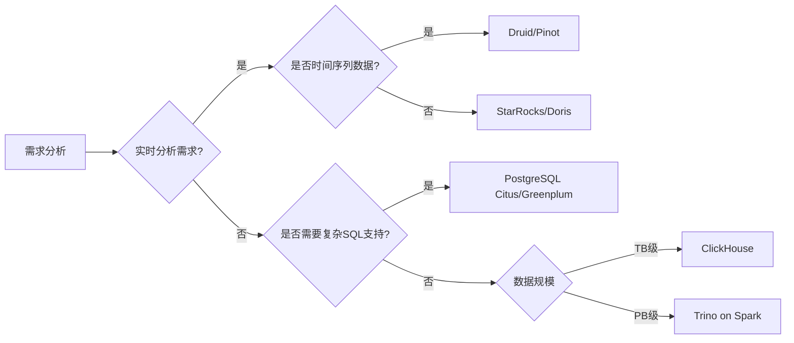

## 参考网址：

1. [【入门精讲】数据仓库原理&实战 - 哈喽鹏程](https://www.bilibili.com/video/BV1qv411y7Wv/?spm_id_from=333.337.search-card.all.click)
2. 《DAMA 数据管理知识体系指南》原书第2版
3. [数据仓库详细介绍-数仓建模-维度和事实设计](https://www.yuque.com/lipengbo-z2uva/datawarehouse/agi120)

